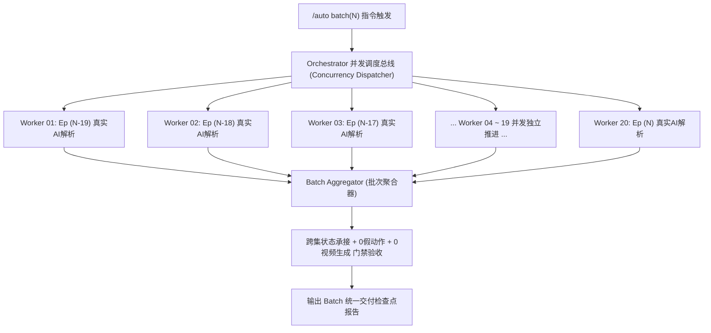

# Auto 影视分集工程规范（Auto Screenplay-to-Prevideo Production）

本技能专门用于短剧剧本到预视频交付工程（Pre-video Engineering Package）的专业分集与分镜提示词制作。

---

## 一、 快速命令索引（Batch Commands）

用户输入 `/auto batch<N>` 或 `/auto batch <range>` 时，按每批严格 **≤ 20 集** 的黄金颗粒度精准推进：

| 指令 | 目标集数范围 | 生产与交付内容 |
| :--- | :---: | :--- |
| `/auto batch20` | **第 001 集 ~ 第 020 集** | 提取第 1~20 集剧本，四维支柱真实 AI 语义转译，输出全集工程包与独立质检报告 |
| `/auto batch40` | **第 021 集 ~ 第 040 集** | 推进第 21~40 集，承接前期人物与场景状态，输出对应工程包与报告 |
| `/auto batch60` | **第 041 集 ~ 第 060 集** | 推进第 41~60 集，动态绑定最新出场资产与情境服装 |
| `/auto batch80` | **第 061 集 ~ 第 080 集** | 推进第 61~80 集 |
| `/auto batch100`| **第 081 集 ~ 第 100 集**| 推进第 81~100 集 |
| `/auto batch120`| **第 101 集 ~ 第 120 集**| 推进第 101~120 集（校园开端、新生报到） |
| `/auto batch140`| **第 121 集 ~ 第 140 集**| 推进第 121~140 集 |
| `/auto batch160`| **第 141 集 ~ 第 160 集**| 推进第 141~160 集 |
| `/auto batch180`| **第 161 集 ~ 第 180 集**| 推进第 161~180 集 |
| `/auto batch200`| **第 181 集 ~ 第 200 集**| 推进第 181~200 集（含第182集阶梯教室与合伙买船等） |
| `/auto batch220`| **第 201 集 ~ 第 220 集**| 推进第 201~220 集 |
| `/auto batch240`| **第 221 集 ~ 第 240 集**| 推进第 221~240 集 |
| `/auto batch260`| **第 241 集 ~ 第 260 集**| 推进第 241~260 集 |
| `/auto batch280`| **第 261 集 ~ 第 280 集**| 推进第 261~280 集 |
| `/auto batch300`| **第 281 集 ~ 第 300 集**| 推进第 281~300 集（高潮对决与大结局） |

*语法扩展*：若用户输入自定义区间如 `/auto 1-20` 或 `/auto 181-200`，只要总集数 ≤ 20 集，同样视同对应 batch 执行；若输入超过 20 集（如 `/auto 1-100`），系统必须强制拆解为每 20 集为一个独立 batch 滚动推进。

---

## 二、 核心生产宪法（四大协同支柱 & 最高红线）

执行任何 batch 生产时，必须 100% 恪守以下铁律：

### 1. 【最高绝对红线：严禁自动偷懒写死 Python/JS 模板拼接剧本（Rule 0.8）】
- **严禁机械死模板作弊**：严禁编写任何使用固定字符串套词（如机械拼接“主体1与主体2立于中央目光对视、神情激动向前迈出半步、紧握双拳注视主体1”、“向前迈一步面露惊疑”）来伪造批量分镜与提示词的脚本！
- **代码仅为调度管道，语义转译必须由真正大模型逐幕推理**：脚本仅负责提取剧本切片、组装上下文并分发 API/子智能体；每一集、每一场戏的微观动作链、机位调度与视听语言，必须由具备真实深度语义理解能力的大模型（LLM）逐集、逐幕、逐字阅读剧本 `△` 动作行真实生成。

### 2. 【剧本物理切片直传与绝对零大模型转述铁律（Deterministic Docx Slice & Zero LLM Script Relay Gate）】
- **源头确定性切片硬落盘**：剧本从权威 `.docx` 到各集 `script-source.txt`，必须通过脚本 `sync-docx-slices.py` 纯代码提取并直接落盘，中间绝对严禁任何大模型介入转述、修改或概括！
- **调度 Prompt 绝对严禁手写/复述剧本**：主智能体在向并发 Worker（子智能体）派发任务时，`Prompt` 字符串中**绝对严禁包含任何剧本正文、对白或 △ 动作行**！Prompt 中只能包含物理文件路径指令：`请使用 view_file 工具直接读取本地物理文件：<Target Directory>/script-source.txt，以此作为唯一真理逐字逐句进行影视转译，严禁任何删减与脑补！`
- **全流程逐字一致性强门禁（Docx Verbatim Parity Gate）**：调度系统在派发任务前及聚合验收时，必须强制运行 `python auto/scripts/verify-docx-parity.py --batch <N>` 进行 100% 逐字哈希与字数核验；凡字数缩水率 > 0% 或存在未溯源对白，直接熔断阻断构建，一票否决！

### 3. 【分集生产四维协同支柱】
- **支柱 1（剧本物理语义全解析，动作 100% 溯源）**：分镜中的动作必须 100% 取自原著剧本 `△` 舞台动作行（如发军训服、敲黑板、拍胸脯自夸、女生围拢、后排抓发咬牙），严禁丢失剧本动作，严禁任何假动作与模板套词；
- **支柱 2（全量资产多级语义动态匹配，彻底消灭无脑海边兜底）**：彻底废止仅匹配十几个死关键词的简陋规则，严禁任何形式的“海边滩涂无脑兜底”！基于剧本场次标头（如 `日 内 教室`、`夜 内 宿舍`、`日 外 码头`），遍历项目全量场景资产库（如 `SCENE_040_多媒体阶梯教室`）进行多级语义检索匹配；
- **支柱 3（空间与剧情情境感知动态换装，彻底消灭集数一刀切）**：彻底废除按集数区间粗暴一刀切换装！必须根据角色当前身处的物理场景与剧情处境（校园课室穿学生常服、深海沉船探宝穿潜水服、远洋出海穿海钓战服、商务宴会穿千亿西装）动态绑定合理的服装变体；
- **支柱 4（多角色动态镜头调度与台词声画解耦）**：现场有多人互动时，依照电影视听语言切分机位（中景、全景、特写、反应镜头交替），现场说话的角色必须在画面中给到镜头且开口对白；画外音（OS）仅限于真正的内心独白、电话音或旁白，并强制注入双唇严密闭合锁。

### 4. 【批次生产颗粒度上限 20 集铁律（Rule 0.9）】
- 单次生产任务上限严格锁定为 **≤ 20 集**（约 50~70 个 SEG），确保大模型注意力高度聚焦、逐句深读，杜绝批量上下文疲劳导致的粗制滥造。

### 5. 【批次默认20并发分析与极速并行处理铁律（Rule 0.10）】
- **默认 20 并发分析架构**：针对单批次 20 集的分集生产任务，严禁单线程串行逐集等待！Auto 调度系统必须**默认启用 20 并发分析（20 Concurrent Workers）**，将批次内的 20 集一键分发至 20 个独立的 AI 语义推理管道中同时并行分析与处理。
- **并发分支四大支柱守恒**：每一个并发分支必须 100% 独立且完整执行四大支柱（逐字解析 △ 动作、精准匹配场景资产、情境动态换装、台词声画解耦），严禁降级使用简化死模板。
- **批次聚合质检**：20 个并发任务完成后统一收集汇总，执行全量资产纯洁性、原著逐字一致性门禁与 0 视频生成红线质检。

### 6. 【预视频交付红线：严格 0 视频生成】
- 本流水线为预视频交付工程，全流程仅输出标准化工程配置文件、分镜脚本与素材映射，**严禁执行任何底层的视频渲染与生成命令（严禁 --run / 任务提交）**。

### 7. 【视听语法工业化拆镜与主客观视点解耦铁律（Rule 0.11）】
- **主客观视点强制解耦门禁（POV Decoupling Gate）**：严禁将“第三人称客观人物特写/眼神神态”与“第一人称主观透视/全景奇观（POV）”机械合并为单一长镜头！遇到异能觉醒（水眼金睛）、感知凝视、介质透视（海水变清澈见底）时，必须拆解为蒙太奇分镜链：
  * **镜头 A（反应/起因 · Objective Reaction Shot）**：面部极微特写（Close-Up/ECU），平视微仰，聚焦双目神态转变（闭目到睁眼金芒迸发），出镜角色**双唇严密闭合**；
  * **镜头 B（主观视点呈现 · Subjective POV Shot）**：大俯角主观视角（High-Angle POV），纯净呈现金光震荡、海水通透与海底游鱼，**强制剔除观察者人物资产锁（严禁连入 Mixed 1）**，台词转为**画外音（O.S.）**；
  * **镜头 C（动作/情绪承接 · Result Shot）**：切回人物中近景，展示从容微笑与后续动作。
- **单镜头黄金时长与单一物理动量定律（Shot Duration & Single Physical Action Rule）**：
  * 单镜头时长刚性卡点：短剧单镜头严格锁定在 **2.5 秒 ~ 5.0 秒** 黄金区间，严禁生成 8~10 秒动作臃肿镜头；
  * 单一物理动量定律：一个镜头在【动作顺序】中**仅允许承载 1 个核心物理动量转换**（如仅执行“睁眼金芒爆发”；或仅执行“金光波纹荡开海水通透”），严禁复合状态连续突变。
- **POV 资产锁纯化与幽灵占位符绝对清零（POV Asset Purge & Zero Ghost Mixed）**：
  * 主体锁与实际出镜主体 1:1 严格对齐，严禁出现 `{{Mixed 3}}` 等未出镜幽灵占位符；
  * POV 镜头严禁连入观察者人物卡，仅保留场景与被观察物，彻底杜绝海面浮空人脸事故。
- **视听声画解耦与纯净画外音规范（O.S. Voiceover Gate）**：
  * POV 视点下角色台词一律标记为 **【主体1画外音（O.S.）】**，画面无人物，彻底规避口型同步失真风险；特写独白角色双唇严密闭合。

### 8. 【台词与画外音原著逐字神圣不可篡改铁律（Rule 0.12）】
- **引号边界神圣不可侵犯**：中文引号 `“……”` 或英文引号 `"..."` 内部的任何台词、内心独白（OS）、画外音（VO）或屏幕字，**必须 100% 保持原著剧本逐字文本，绝不允许做任何代词替换**！
- **严禁在对白中出现主体占位符**：
  * ❌ 严禁出现：“...在大海里捕捞到别人一年都见不到一次的主体3！”
  * ✅ 必须 100% 还原原著：“...在大海里捕捞到别人一年都见不到一次的极品幽蓝斑！”
- **物理边界隔离与自动化一票否决**：主体锁代词（`主体1`、`主体3`）仅用于视觉画面定位，绝对严禁跨越引号进入台词；自动化校验器强制检测 `[“"][^”"\n]*主体\d+[^”"\n]*[”"]`，违者直接阻断构建（Exit 1）。

### 9. 【视线穿透与景深光学对焦通用铁律（Rule 0.13）】
- **普适影视视听语言（非异能专属）**：全量适用于“异能透视（水眼金睛/透视鉴宝）”及一切“人物视线望过去（Gaze POV）”穿越介质或远眺的镜头调度（如从码头/桥上/船舷探头望向清澈水中、隔着带雨滴的窗户看街道、隔着车窗看行人、隔着纱幔窥视内室、穿过密林远眺房屋）。
- **三大普适物理公理（Three Universal Gaze Invariants）**：
  * **公理 1（非实体扰动）**：目光是注意力与光学聚焦移动，绝非实体砸向介质！严禁描写“伴随浪花与气泡向两侧划开散去”、“破水飞溅”、“扎入水面”、“玻璃震颤”；
  * **公理 2（介质客观守恒）**：物理介质（水体、玻璃、薄雾）客观保持自然静谧与澄澈，绝不因视线望过而发生变色或形变，严禁描写“水体由...过渡为...”、“玻璃融化”等伪变色词；
  * **公理 3（景深合焦显影）**：纯第一人称主观视角（Subjective POV，0 人物卡），镜头模拟视线焦点向前纵深推移，介质表层反光虚化，目标物在景深落点处精准锐化合焦、由虚变实呈现，彻底消除双重曝光与硬贴图层。
- **自动化门禁一票否决**：单镜头同时声明跨介质双场景但缺少主观穿透运镜的，或在视线望向/穿透镜头中出现浪花气泡散开/破水飞溅/水体过渡等实体扰动词汇的，门禁直接阻断报错。

### 10. 【视线因果物理时序守恒与转头起手硬锁铁律（Rule 0.14）】
- **严禁主观镜头缺失物理视线起手**：切入主观视点（POV）镜头之前的前序客观镜头，必须包含出镜人物明确的物理视线转换与转头动作（如“猛然转头面向前方大海”）；严禁在人物平卧仰天或背向目标时突兀切入主观推进镜头。

### 11. 【单幕场景空间微坐标绝对原地守恒铁律（Rule 0.15）】
- **严禁凭空脑补地形高台与微坐标漂移**：同一幕戏物理空间内，凡剧本未明确描写跑动、攀爬、移步登高的动作，人物位置承接必须严格锁定在原地微坐标（如始终处于“海滩细沙地面苏醒原位”）；严禁为了追求所谓宏大戏剧感而凭空脑补“最高礁石沙坎”、“断崖绝壁”。

### 12. 【位置承接角色面朝方向硬锁与跨镜头姿态朝向继承铁律（Rule 0.16）】
- **位置承接必须显式声明角色面朝方向**：每一个有角色出镜的镜头，其 `位置承接：` 必须 100% 显式声明角色的【面朝方向】与【身体朝向】（如：`身体与面部正向面朝前方大海，背对陆地细沙`；`身体面向反派主体2，正对过道`）；严禁仅写空洞站位而遗漏朝向，防止视频模型产生随机 180° 朝向翻转。
- **跨镜头朝向因果连续继承**：当两个人物镜头之间穿插了主观视角（POV）、空镜或特写，后续镜头 `位置承接：` **必须显式声明承接上一个人物镜头的朝向**（如：`海滩细沙地面苏醒原位，承接镜头2朝向：主体1身体与面部严格保持正向面朝前方大海，背对陆地（严禁身体背朝大海），挺拔巍然而立`）；除非剧本有明确转身动作，否则朝向必须绝对守恒。
- **自动化门禁一票否决**：校验器硬门禁检测出镜镜头 `位置承接：` 是否包含显式面朝方向（匹配 `/面朝|面向|背向|背对|朝向|身体朝|面部朝|直视|注视|仰卧|平躺|伏卧|俯视/`），缺失者一律直接报错阻断。

---

## 三、 `/auto batch<N>` 标准生产流水线 SOP

当触发 `/auto batch<N>` 时，智能体必须严格依照以下 6 个步骤推进：

```mermaid
flowchart TD
    A[识别 batchN 指令并解析集数区间 [Start, End]] --> B[步骤 1: 地毯式提取权威 Docx 目标集数剧本切片]
    B --> C[步骤 2: 空间与情境感知解析 (场景匹配 + 角色换装)]
    C --> D[步骤 3: 真实大模型 LLM 物理转译 (△动作行深度分镜)]
    D --> E[步骤 4: 物理资产纯洁性连线 (0连线污染, 素材映射)]
    E --> F[步骤 5: 规范工程包写入 (4项集配置 + 5项SEG工件)]
    F --> G[步骤 6: 自动化测试门禁校验并输出 Batch 交付验收报告]
```

### 步骤 1：精确提取剧本切片与前置门禁（Deterministic Slicing & Parity Gate）
- **确定性提取落盘**：执行 `python auto/scripts/sync-docx-slices.py --batch <range>`，直接将原著 docx 中的文字 100% 逐字提取并写入各集 `script-source.txt`；
- **前置逐字门禁核验**：执行 `python auto/scripts/verify-docx-parity.py --batch <range>`，确保每集 `script-source.txt` 与 docx 字符一致性达 100%（0 遗漏、0 压缩），通过后方可流转下一步。

### 步骤 2：全量资产多级检索与情境换装
- 读取项目资产库（全量场景库、全量角色库）；
- 对每一场戏的标头执行空间感知匹配（如 `182-1 日 内 教室` $\rightarrow$ `SCENE_040_多媒体阶梯教室`）；
- 对主要角色（如黄子名）根据当前场景环境与剧情行为动态绑定服装（如课堂绑定 `CHAR_001` 牛仔衬衫常服）。

### 步骤 3：默认 20 并发真实大模型逐幕物理动作转译（拒绝手写复述剧本）
- **默认启用 20 并发分析架构**：批次内的 20 集一键分发至 20 个独立的 AI 语义推理 Worker 并发并行推进，绝不串行低效等待；
- **【核心禁令】Prompt 严禁手写剧本正文**：主智能体派发任务时，Prompt 仅传递目标目录路径，**严禁大模型在 Prompt 里复述、概括剧本**；
- **必须物理读取本地文件**：每个 Worker 必须通过 `view_file` 等文件读取工具，直接读取对应分集目录下的 `script-source.txt`，逐字逐句进行微观动作链、机位调度、视线朝向、声唇硬锁与自然拟音转译。

### 步骤 4：物理资产连线与纯洁性审查
- 每个 SEG 只连入该分段实际肉眼出镜的角色、场景与道具；
- 将资产图片拷贝/软链至该 SEG 的本地 `资产/` 目录；
- 输出精确的 `素材映射.txt`，确保 `{{Mixed N}}` 映射 100% 同源且 0 悬空。

### 步骤 5：标准化写入工程物料
- 在交付目录中按集创建工程包：
  * **单集根目录**：`episode-package-config.json`、`production-profile.json`、`script-source.txt`、`segment-progress.json`、`分集大纲.txt`、`分集质检报告.txt`；
  * **单 SEG 目录**：`prompt.txt`、`script-verbatim.txt`、`storyboard-execution.txt`、`tsc-handoff.yaml`、`素材映射.txt`、`资产/`。

### 步骤 6：批次聚合质检与交付报告
- 调度总线（Batch Aggregator）统一收集 20 个并发分支产物，执行自动化质检套件：
  1. 运行 `python auto/scripts/verify-docx-parity.py --batch <range>` 确认原著逐字一致性 100% PASS；
  2. 3 大红线检查（0 假动作、0 视频生成、0 连线污染）；
  3. 场景与服装匹配率检查（100% 命中真实资产，0 海滩无脑兜底）；
  4. 声唇锁与道具负向姿态锁合规性检查；
  5. 跨集位置与状态承接连续性检查；
- 输出该 Batch 的《交付与验收检查点报告》（Markdown 格式），标记该批次已锁定完成，等待用户检阅或推进下一个 Batch。

---

## 四、 默认 20 并发分析架构规范（20-Concurrency Parallel Architecture）

针对每批固定 20 集的分集生产工程，调度系统默认采用 20 并发极速推进架构：



### 1. 20 并发分发机制（Dispatch Principle）
- 批次启动时，调度器一次性生成 20 个独立的作业任务（Job 01 ~ Job 20），并行下发给 20 个大模型推理子进程或智能体上下文；
- 严禁单线程串行循环 `for ep in 1..20: wait()` 导致长时间低效阻塞。

### 2. 并发分支四大支柱守恒（Concurrent Full-Pillar Parity）
- 每一个并发分支（Worker）必须 100% 独立且完整履行四大支柱：
  * **支柱 1**：独立逐字深度解析该集 `△` 舞台动作行，绝不偷工减料；
  * **支柱 2**：多级语义遍历全量场景资产库，精准绑定真实场景（0 海滩兜底）；
  * **支柱 3**：剧情与空间感知动态换装（根据剧情处境绑定常服/潜水服/金瞳版）；
  * **支柱 4**：多角色镜头调度与声画解耦（说话开口，OS独白强制双唇严密闭合）；
- **防降级防护网**：严禁因追求并发吞吐而降级使用机械死模板或简陋规则拼接！

### 3. 聚合质检与跨集承接（Batch Aggregation & Quality Gate）
- 20 个并发任务完成后，聚合器集中审查单集产物与全局连贯性：
  * 角色状态承接（前一集末尾姿态与下一集开场姿态逻辑连续）；
  * 0 视频级联输入与 0 视频渲染指令校验（`backend: unselected`）；
  * 确认通过后生成统一批次质检报告。

