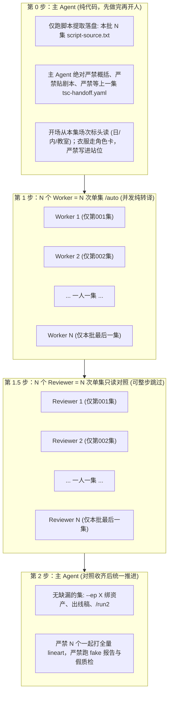

# Auto 影视分集工程规范（Auto Screenplay-to-Prevideo Production）

本技能专门用于短剧剧本到预视频交付工程（Pre-video Engineering Package）的专业分集与分镜提示词制作。

---

## 一、 快速命令索引（Batch Commands）

用户输入 `/auto batch<N>` 或 `/auto batch <range>` 时，按每批严格 **≤ 20 集** 的黄金颗粒度精准推进：

| 指令 | 目标集数范围 | 生产与交付内容 |
| :--- | :---: | :--- |
| `/auto batch20` | **第 001 集 ~ 第 020 集** | 提取第 1~20 集剧本，四维支柱真实 AI 语义转译，输出全集工程包与独立质检报告 |
| `/auto batch40` | **第 021 集 ~ 第 040 集** | 推进第 21~40 集，承接前期人物与场景状态，输出对应工程包与报告 |
| `/auto batch60` | **第 041 集 ~ 第 060 集** | 推进第 41~60 集，动态绑定最新出场资产与情境服装 |
| `/auto batch80` | **第 061 集 ~ 第 080 集** | 推进第 61~80 集 |
| `/auto batch100`| **第 081 集 ~ 第 100 集**| 推进第 81~100 集 |
| `/auto batch120`| **第 101 集 ~ 第 120 集**| 推进第 101~120 集（校园开端、新生报到） |
| `/auto batch140`| **第 121 集 ~ 第 140 集**| 推进第 121~140 集 |
| `/auto batch160`| **第 141 集 ~ 第 160 集**| 推进第 141~160 集 |
| `/auto batch180`| **第 161 集 ~ 第 180 集**| 推进第 161~180 集 |
| `/auto batch200`| **第 181 集 ~ 第 200 集**| 推进第 181~200 集（含第182集阶梯教室与合伙买船等） |
| `/auto batch220`| **第 201 集 ~ 第 220 集**| 推进第 201~220 集 |
| `/auto batch240`| **第 221 集 ~ 第 240 集**| 推进第 221~240 集 |
| `/auto batch260`| **第 241 集 ~ 第 260 集**| 推进第 241~260 集 |
| `/auto batch280`| **第 261 集 ~ 第 280 集**| 推进第 261~280 集 |
| `/auto batch300`| **第 281 集 ~ 第 300 集**| 推进第 281~300 集（高潮对决与大结局） |

*语法扩展*：若用户输入自定义区间如 `/auto 1-20` 或 `/auto 181-200`，只要总集数 ≤ 20 集，同样视同对应 batch 执行；若输入超过 20 集（如 `/auto 1-100`），系统必须强制拆解为每 20 集为一个独立 batch 滚动推进。

---

## 二、 核心生产宪法（四大协同支柱 & 最高红线）

执行任何 batch 生产时，必须 100% 恪守以下铁律：

### 1. 【最高绝对红线：严禁自动偷懒写死 Python/JS 模板拼接剧本（Rule 0.8）】
- **严禁机械死模板作弊**：严禁编写任何使用固定字符串套词（如机械拼接“主体1与主体2立于中央目光对视、神情激动向前迈出半步、紧握双拳注视主体1”、“向前迈一步面露惊疑”）来伪造批量分镜与提示词的脚本！
- **代码仅为调度管道，语义转译必须由真正大模型逐幕推理**：脚本仅负责提取剧本切片、组装上下文并分发 API/子智能体；每一集、每一场戏的微观动作链、机位调度与视听语言，必须由具备真实深度语义理解能力的大模型（LLM）逐集、逐幕、逐字阅读剧本 `△` 动作行真实生成。

### 2. 【剧本物理切片直传与绝对零大模型转述铁律（Deterministic Docx Slice & Zero LLM Script Relay Gate）】
- **源头确定性切片硬落盘**：剧本从权威 `.docx` 到各集 `script-source.txt`，必须通过脚本 `sync-docx-slices.py` 纯代码提取并直接落盘，中间绝对严禁任何大模型介入转述、修改或概括！
- **调度 Prompt 绝对严禁手写/复述剧本**：主智能体在向并发 Worker（子智能体）派发任务时，`Prompt` 字符串中**绝对严禁包含任何剧本正文、对白或 △ 动作行**！Prompt 中只能包含物理文件路径指令：`请使用 view_file 工具直接读取本地物理文件：<Target Directory>/script-source.txt，以此作为唯一真理逐字逐句进行影视转译，严禁任何删减与脑补！`
- **全流程逐字一致性强门禁（Docx Verbatim Parity Gate）**：调度系统在派发任务前及聚合验收时，必须强制运行 `python auto/scripts/verify-docx-parity.py --batch <N>` 进行 100% 逐字哈希与字数核验；凡字数缩水率 > 0% 或存在未溯源对白，直接熔断阻断构建，一票否决！

### 3. 【分集生产四维协同支柱】
- **支柱 1（剧本物理语义全解析，动作 100% 溯源）**：分镜中的动作必须 100% 取自原著剧本 `△` 舞台动作行（如发军训服、敲黑板、拍胸脯自夸、女生围拢、后排抓发咬牙），严禁丢失剧本动作，严禁任何假动作与模板套词；
- **支柱 2（全量资产多级语义动态匹配，彻底消灭无脑海边兜底）**：彻底废止仅匹配十几个死关键词的简陋规则，严禁任何形式的“海边滩涂无脑兜底”！基于剧本场次标头（如 `日 内 教室`、`夜 内 宿舍`、`日 外 码头`），遍历项目全量场景资产库（如 `SCENE_040_多媒体阶梯教室`）进行多级语义检索匹配；
- **支柱 3（空间与剧情情境感知动态换装，彻底消灭集数一刀切）**：彻底废除按集数区间粗暴一刀切换装！必须根据角色当前身处的物理场景与剧情处境（校园课室穿学生常服、深海沉船探宝穿潜水服、远洋出海穿海钓战服、商务宴会穿千亿西装）动态绑定合理的服装变体；
- **支柱 4（多角色动态镜头调度与台词声画解耦）**：现场有多人互动时，依照电影视听语言切分机位（中景、全景、特写、反应镜头交替），现场说话的角色必须在画面中给到镜头且开口对白；画外音（OS）仅限于真正的内心独白、电话音或旁白，并强制注入双唇严密闭合锁。

### 4. 【批次生产颗粒度上限 20 集铁律（Rule 0.9）】
- 单次生产任务上限严格锁定为 **≤ 20 集**（约 50~70 个 SEG），确保大模型注意力高度聚焦、逐句深读，杜绝批量上下文疲劳导致的粗制滥造。

### 5. 【批次默认20并发分析与极速并行处理铁律（Rule 0.10）】
- **默认 20 并发分析架构**：针对单批次 20 集的分集生产任务，严禁单线程串行逐集等待！Auto 调度系统必须**默认启用 20 并发分析（20 Concurrent Workers）**，将批次内的 20 集一键分发至 20 个独立的 AI 语义推理管道中同时并行分析与处理。
- **并发分支四大支柱守恒**：每一个并发分支必须 100% 独立且完整执行四大支柱（逐字解析 △ 动作、精准匹配场景资产、情境动态换装、台词声画解耦），严禁降级使用简化死模板。
- **批次聚合质检**：20 个并发任务完成后统一收集汇总，执行全量资产纯洁性、原著逐字一致性门禁与 0 视频生成红线质检。

### 6. 【预视频交付红线：严格 0 视频生成】
- 本流水线为预视频交付工程，全流程仅输出标准化工程配置文件、分镜脚本与素材映射，**严禁执行任何底层的视频渲染与生成命令（严禁 --run / 任务提交）**。

### 7. 【视听语法工业化拆镜与主客观视点解耦铁律（Rule 0.11）】
- **主客观视点强制解耦门禁（POV Decoupling Gate）**：严禁将“第三人称客观人物特写/眼神神态”与“第一人称主观透视/全景奇观（POV）”机械合并为单一长镜头！遇到异能觉醒（水眼金睛）、感知凝视、介质透视（海水变清澈见底）时，必须拆解为蒙太奇分镜链：
  * **镜头 A（反应/起因 · Objective Reaction Shot）**：面部极微特写（Close-Up/ECU），平视微仰，聚焦双目神态转变（闭目到睁眼金芒迸发），出镜角色**双唇严密闭合**；
  * **镜头 B（主观视点呈现 · Subjective POV Shot）**：大俯角主观视角（High-Angle POV），纯净呈现金光震荡、海水通透与海底游鱼，**强制剔除观察者人物资产锁（严禁连入 Mixed 1）**，台词转为**画外音（O.S.）**；
  * **镜头 C（动作/情绪承接 · Result Shot）**：切回人物中近景，展示从容微笑与后续动作。
- **长视频大模型黄金长镜头与连贯叙事定律（Cinematic Long-Shot & Continuity Law · Auto-STX Standard）**：
  * **单段镜头数量与单镜头黄金时长**：单个视频分段（SEG，通常 20~28 秒）严格遵循长视频大模型（SD 2.5 / WAN 3.0）的黄金视听规律，**每个 SEG 保持 2 ~ 3 个连贯长镜头（单镜头时长建议在 8 秒 ~ 14 秒，如 12s+13s 或 8s+8s+9s）**，严禁过度切碎为 2~3 秒的零碎微镜头；
  * **动作连贯完整定律**：同一镜头内应包容完整的动作起承转合、肢体物理演进与现场对白交互，给演员预留充足的表演与受力识别时间；仅在主客观视点解耦（POV）、场景空间转换或核心爆点反转时进行切镜，严禁单一简单动作即草率切镜。
- **POV 资产锁纯化与幽灵占位符绝对清零（POV Asset Purge & Zero Ghost Mixed）**：
  * 主体锁与实际出镜主体 1:1 严格对齐，严禁出现 `{{Mixed 3}}` 等未出镜幽灵占位符；
  * POV 镜头严禁连入观察者人物卡，仅保留场景与被观察物，彻底杜绝海面浮空人脸事故。
- **视听声画解耦与纯净画外音规范（O.S. Voiceover Gate）**：
  * POV 视点下角色台词一律标记为 **【主体1画外音（O.S.）】**，画面无人物，彻底规避口型同步失真风险；特写独白角色双唇严密闭合。

### 8. 【台词与画外音原著逐字神圣不可篡改铁律（Rule 0.12）】
- **引号边界神圣不可侵犯**：中文引号 `“……”` 或英文引号 `"..."` 内部的任何台词、内心独白（OS）、画外音（VO）或屏幕字，**必须 100% 保持原著剧本逐字文本，绝不允许做任何代词替换**！
- **严禁在对白中出现主体占位符**：
  * ❌ 严禁出现：“...在大海里捕捞到别人一年都见不到一次的主体3！”
  * ✅ 必须 100% 还原原著：“...在大海里捕捞到别人一年都见不到一次的极品幽蓝斑！”
- **物理边界隔离与自动化一票否决**：主体锁代词（`主体1`、`主体3`）仅用于视觉画面定位，绝对严禁跨越引号进入台词；自动化校验器强制检测 `[“"][^”"\n]*主体\d+[^”"\n]*[”"]`，违者直接阻断构建（Exit 1）。

### 9. 【视线穿透与景深光学对焦通用铁律（Rule 0.13）】
- **普适影视视听语言（非异能专属）**：全量适用于“异能透视（水眼金睛/透视鉴宝）”及一切“人物视线望过去（Gaze POV）”穿越介质或远眺的镜头调度（如从码头/桥上/船舷探头望向清澈水中、隔着带雨滴的窗户看街道、隔着车窗看行人、隔着纱幔窥视内室、穿过密林远眺房屋）。
- **三大普适物理公理（Three Universal Gaze Invariants）**：
  * **公理 1（非实体扰动）**：目光是注意力与光学聚焦移动，绝非实体砸向介质！严禁描写“伴随浪花与气泡向两侧划开散去”、“破水飞溅”、“扎入水面”、“玻璃震颤”；
  * **公理 2（介质客观守恒）**：物理介质（水体、玻璃、薄雾）客观保持自然静谧与澄澈，绝不因视线望过而发生变色或形变，严禁描写“水体由...过渡为...”、“玻璃融化”等伪变色词；
  * **公理 3（景深合焦显影）**：纯第一人称主观视角（Subjective POV，0 人物卡），镜头模拟视线焦点向前纵深推移，介质表层反光虚化，目标物在景深落点处精准锐化合焦、由虚变实呈现，彻底消除双重曝光与硬贴图层。
- **自动化门禁一票否决**：单镜头同时声明跨介质双场景但缺少主观穿透运镜的，或在视线望向/穿透镜头中出现浪花气泡散开/破水飞溅/水体过渡等实体扰动词汇的，门禁直接阻断报错。

### 10. 【视线因果物理时序守恒与转头起手硬锁铁律（Rule 0.14）】
- **严禁主观镜头缺失物理视线起手**：切入主观视点（POV）镜头之前的前序客观镜头，必须包含出镜人物明确的物理视线转换与转头动作（如“猛然转头面向前方大海”）；严禁在人物平卧仰天或背向目标时突兀切入主观推进镜头。

### 11. 【单幕场景空间微坐标绝对原地守恒铁律（Rule 0.15）】
- **严禁凭空脑补地形高台与微坐标漂移**：同一幕戏物理空间内，凡剧本未明确描写跑动、攀爬、移步登高的动作，人物位置承接必须严格锁定在原地微坐标（如始终处于“海滩细沙地面苏醒原位”）；严禁为了追求所谓宏大戏剧感而凭空脑补“最高礁石沙坎”、“断崖绝壁”。

### 12. 【位置承接角色面朝方向硬锁与跨镜头姿态朝向继承铁律（Rule 0.16）】
- **位置承接必须显式声明角色面朝方向**：每一个有角色出镜的镜头，其 `位置承接：` 必须 100% 显式声明角色的【面朝方向】与【身体朝向】（如：`身体与面部正向面朝深景处的远景大海，后背严格背向近景陆地细沙`；`身体面向反派主体2，正对过道`）；严禁仅写空洞站位而遗漏朝向，防止视频模型产生随机 180° 朝向翻转。
- **跨镜头朝向因果连续继承**：当两个人物镜头之间穿插了主观视角（POV）、空镜或特写，后续镜头 `位置承接：` **必须显式声明承接上一个人物镜头的朝向与空间锚点**（如：`海滩细沙地面苏醒原位，承接镜头2朝向与空间锚点：主体1身体与面部严格正向面朝深景处的远景大海，后背严格背向近景陆地细沙（绝对严禁背朝远景大海或面朝近景陆地），挺拔巍然而立`）；除非剧本有明确转身动作，否则朝向必须绝对守恒。
- **自动化门禁一票否决**：校验器硬门禁检测出镜镜头 `位置承接：` 是否包含显式面朝方向（匹配 `/面朝|面向|背向|背对|朝向|身体朝|面部朝|直视|注视|仰卧|平躺|伏卧|俯视/`），缺失者一律直接报错阻断。

### 13. 【场景物理锚点与景深层次绝对守恒最高铁律 · 彻底废除无参照系模糊方向词（Rule 0.17）】
- **【最高绝对红线：彻底禁止无参照系的模糊方向词】**：
  * **绝对严禁在提示词中使用孤立、模糊的方向词汇（如“前方”、“正前方”、“向前方”、“后方”、“正后方”）**！
  * 视频生成模型易混淆摄影机机位（屏幕前方）与角色视线（场景深处），导致致命的 180° 朝向反转；
  * 任何方向描述必须由**【场景物理实体锚点】+【景深层次（远景/中景/近景/深景）】+【角色朝向（面朝/面向/背向/背对）】**客观坐标三元组唯一定义。
- **【场景物理锚点与景深层次绝对绑定公理】**：
  * **若物理锚点为远景（Background）**：如大海处于画面深处背景，角色看向大海，则**必须显式写明角色“身体与面部正向面朝深景处的远景大海，后背严格背向近景陆地细沙”**；
  * **若物理锚点为近景（Foreground）**：如大海处于贴近镜头的前景，角色看向大海，则**必须显式写明角色“身体面向近景大海，后背背向远景陆地”**；严禁脱离景深层次凭空描述朝向！
- **【单个片段内物理锚点景深层次绝对恒定守恒】**：
  * 在同一分段（SEG）的连续叙事空间内，**场景物理锚点的景深层次绝对禁止突变或漂移**！
  * 如果大海在初始镜头被确立为远景（`远景大海`），全段所有镜头中大海必须恒定为远景；角色面向大海必须恒定为“面朝远景大海”，角色立于沙滩必须恒定为“立于近景细沙”；严禁同一场景内前后颠倒景深层次。
- **【自动化门禁一票否决】**：
  * 校验器强制扫描 `位置承接` 与 `动作/表演`：凡出现孤立模糊词 `正前方|正后方|向前方|前方海面` 且未声明景深层级（`远景|中景|近景|深景`），或出镜镜头缺失物理锚点与景深层次声明，直接阻断报错（Exit 1）。

### 14. 【声画对白绝对人嘴开口与OS画外音严格隔离铁律 · 彻底废除 O.S. 标签污染（Rule 0.18）】
- **【最高绝对红线：原著剧本未标注 OS 则必须 100% 物理张嘴开口发音】**：
  * **原著 OS 独占原则**：凡剧本未显式标注 `(OS)` 的台词，**100% 必须定性为现场真实对白（On-Screen Dialogue），必须安排在人物出镜的镜头中，由人物嘴唇同步张合发声（人嘴说话）**！
  * **绝对严禁擅自打成画外音**：严禁将剧本正常台词偷懒做成“配音在响、人物闭嘴不动”的画外音（O.S.）！绝对严禁因镜头为主观视点（POV）或空镜而擅自把无 OS 标头的正常对白降维为画外音；
  * **只有原著明确标有 (OS) 方为画外音**：只有当原著剧本显式标注 `(OS)` 时，方可判定为内心独白画外音，且出镜人物必须双唇严密闭合。
- **【彻底清除字段标签中的 O.S./OS 污染词】**：
  * 彻底废除死板通用的 `台词/O.S./OS：` 混合标签！影视工业中 `O.S.`（Off-Screen）是强负向分类词，会诱导视频大模型直接生成闭口画外音；
  * 现场对白镜头必须使用纯净字段标签 `台词：`（或 `对白：`），绝对禁止出现 `O.S.`、`OS`、`画外音`；
  * 仅当原著剧本明确标注 `(OS)` 时，方可使用 `台词（画外音）：` 或 `画外音（O.S.）：`。
- **【动作/表演必须显式注入物理开口动作】**：
  * 多模态视频扩散模型以 `动作/表演：` 作为第一帧与运动生成的绝对主干驱动；
  * 凡包含现场对白的镜头，`动作/表演：` 的【动作顺序】中**必须显式包含人物嘴部张合发音动作**（如：`嘴唇根据台词清晰自然张合开口发声，面部肌肉配合咬字，严禁紧闭双唇`），并在【动作后状态】中闭口恢复；动作字段遗漏张嘴动作一律定性为重大穿帮！
### 15. 【台词剧情容量、动作分级与分段结束边界铁律（Rule 0.19，7.2/7.3/7.4规范）】
- **【台词与剧情容量刚性门禁（Dialogue & Plot Capacity Rule，7.2规范）】**：
  * **容量基准**：每 15 秒 Prompt 台词容量建议为 20—45 字（25~30秒片段上限约 40—90 字）；单镜头建议 8—18 字；戏剧强爆点镜头 4—10 字；
  * **短句承载**：4—10 字短句若非重大反转、身份揭露、关键证据或强爆点，必须继续承载后续原文剧情，严禁无意义切片；
  * **中长句整合**：10—20 字镜头优先整合后续台词、有效动作、反应或结果；20—45 字结合人物语速与动作复杂度综合界定分段边界；
  * **超长对白拆分红线**：原文台词超过 45 字时，**必须原样拆分到多个镜头或独立 Prompt（SEG），严禁删改对白、严禁颠倒顺序、严禁异常倍速快进**；
  * **严禁虚构台词**：剧本台词不足 20 字时绝对严禁擅自添油加醋补写台词；“70%动作+30%台词”仅作为视听节奏参考。
- **【A/B/C 动作分级与物理时间守恒铁律（A/B/C Action Hierarchy Rule，7.3规范）】**：
  * **A级关键动作**：改变剧情结果、冲突、证据、关系或人物状态（如踢桶逼债、横切截拳、大鱼砸地水花四溅、合力扛鱼逃窜），必须完整写清起点、过程、结果，且在镜头时间分配上预留充足物理时间（通常需 1.5~3 秒）；
  * **B级连接动作**：起身、走近、开门、坐下、递接物品等，按最短可识别原则快速完成；
  * **C级装饰动作**：整理衣物、回望、普通停顿、重复小表情等，附着在台词或关键动作中或直接剔除；
  * **动作时长守恒**：连续简单动作优先合并；日常动作通常需 1—2 秒方可被观众肉眼清晰识别，在台词与动作并存时，台词时长优先保障，动作不得被超载台词挤压吞噬。
- **【镜头有效性与 Prompt 结束分段边界铁律（Shot Validity & Segment Boundary Gate，7.4规范）】**：
  * **镜头存在合法性**：无台词镜头必须承担关键证据、重大入场、危险警报、状态变化、动作结果、视觉反转、剧情钩子或画面独有信息；无台词 + 无状态变化 + 无新增信息 + 无剧情结果 = 坚决合并或直接删除；
  * **严禁草率断句**：绝对严禁仅因一句话说完、一个简单动作完成、人物转头/到达、普通表情出现而草率结束 Prompt；
  * **结束 Prompt 的唯一合法条件**：仅在 15~28 秒容量已饱和、完整剧情节点结束、继续承载会导致超时/破坏正常说话语速（语速超过 4.5 字/秒）、场景/时间切换，或关键爆点与悬念钩子需要强化时，方可结束当前 Prompt；
### 16. 【介质透视主客观解耦与大俯角水体构图铁律 · 彻底杜绝飞鱼上天穿帮（Rule 0.20，POV Underwater Angle & Zero Sky-Fish Gate）】
- **【最高绝对红线：严禁在含天空或人物的客观镜头中描写水下生物（Zero Fish in Sky Rule）】**：
  * 凡剧本中出现“看向海面/透视水面/看清海底鱼群/水生物”等介质透视镜头，**必须严格强制执行【主客观双镜蒙太奇解耦】**；
  * **绝对严禁在包含天空、地平线、开阔苍穹或第三人称人物的客观镜头中描写“水中游鱼/水底生物”**！大模型在客观全景中无法理解水体介质折射，必然将鱼群渲染至天空或空气中，产生“鱼在天上飞”的致命重大穿帮（直接触发一票否决）；
- **【主客观视点三段式蒙太奇拆镜标准】**：
  * **① 客观起因镜头（Objective Setup Shot）**：镜头聚焦出镜人物（如黄子名跨出院门，昂首望向远方海面，双目微凝金芒内敛）。画面中**仅允许出现人物与陆地/废墟/海面大环境，严禁描写任何水中生物或水底细节**；
  * **② 纯第一人称大俯角主观透视镜头（Subjective High-Angle POV Shot）**：
    - **机位构图绝对隔离**：机位必须声明为**【大俯角垂直向下俯视水面（High-Angle Top-Down POV looking directly down into water）】**；
    - **画面元素绝对纯净**：视场内 **100% 仅限于清澈透明的海水、阳光穿透的水波与海底基底（海底白沙、暗礁、珊瑚），绝对严禁包含任何天空、地平线、苍穹、海岸线或人物身体（0 天空、0 人物）**；
    - **生物游弋空间绝对锚定**：鱼群（如野生黄鱼、银鲳、极品幽蓝斑）必须显式限定在**“海底细沙与礁石珊瑚之间的水体深处穿梭游曳（swimming underwater near seafloor rocks）”**，从物理构图与几何视场上彻底切断天空元素，100% 消除飞鱼幻觉；
    - **台词强制声画解耦**：出镜人物不露脸，台词一律声明为**【内心声音/画外音（O.S.）】**；
  * **③ 客观神态承接镜头（Objective Result Shot）**：镜头迅速切回出镜人物低角度仰拍或正向特写，展现自信从容微笑与坚定宣告对白。
- **【资产连线纯洁性防飞鱼延伸禁令】**：
  * 若该分段剧情中道具（如极品幽蓝斑）已被反派扛走或未在现场实体出现，**绝对严禁将该道具资产卡作为入边连入视频节点**，防止大模型产生“强迫展示道具”先验而把鱼直接贴在空中。

### 17. 【站位与起始状态绝对禁入穿着声明铁律 · 严防破坏角色卡锁装穿帮（Rule 0.21，Zero Wardrobe Declaration in Staging Gate）】
- **【最高绝对红线：站位与起始状态绝对严禁包含任何穿着/服装声明（Zero Clothing in Staging Rule）】**：
  * 严禁在【站位与起始状态】、【结束状态】、位置承接或分镜动作描述中凭空描写或添加任何未经资产卡定义的自创穿着声明（如‘身穿粗布工装’、‘身穿短袖’、‘身穿便服’等）！
  * 角色的服装款式、颜色、材质与细节必须 **100% 且唯一来自角色参考图资产卡**（由【资源引用】明确约束：`右上格提供正面服装，右下格提供背面发型与服装`）；
  * 严禁通过提示词中的抽象服装词汇随意覆盖、篡改或二次引导角色穿搭！任何文字中的服装描写都会诱发大模型先验偏见，强行覆盖角色参考卡，导致‘同一角色换一套衣服、违背资产卡’的全局严重穿帮事故（直接触发一票否决）；
- **【站位与起始状态纯粹物理化空间定位（Pure Physical Spatial Staging Only）】**：
  * 【站位与起始状态】仅允许声明角色的**物理坐标、站立/坐卧姿态、朝向、视线聚焦以及与环境/道具的相对空间关系**（如‘主体1立于主体2船首中央，身体面向深景处的远景海面，后背朝向近景船舱，神情专注坚毅’）；
  * 严禁夹带任何服装、鞋帽、饰品描述，彻底杜绝先验冲突。

### 18. 【Prompt 显式左右边空间坐标声明与景深四维协同绝对门禁（Rule 0.22，Explicit Screen Coordinate Gate）】
- **【最高绝对红线：彻底禁止无左右参照系的模糊相对站位词】**：
  * 严禁在【站位与起始状态】、【位置承接】、【动作/表演】中使用 `身侧`、`旁侧`、`身旁`、`旁边`、`在旁` 等孤立模糊相对位置词；
  * 每一个角色的站位与走位必须具有明确的屏幕横向绝对坐标：`画左`、`画右` 或 `主体X左侧/右侧半步`；
  * 必须与【锚点景深（前景/中景/深景）】、【身体面朝方向】、【视线聚焦目标】四维协同锁死。

### 19. 【场景/时间/光线极简纯物理引用门禁（Rule 0.23，Concise Scene Staging Gate）】
- **【最高绝对红线：严禁在【场景/时间/光线】中堆砌文学修辞或微观环境展开】**：
  * 【场景/时间/光线】字数严格限制在 ≤ 25 字，必须为纯粹物理引用：如 `主体2场景，日景自然光照。` 或 `主体3场景，夜景自然光照。`；
  * 微观物理互动与道具接触统一归入【动作/表演】。

### 20. 【站位线稿（Lineart）与分镜定妆图双轨解耦规范（Rule 0.24，Mandatory Storyboard Keyframe Image & Spatial Lineart Decoupling Gate）】
- **双轨解耦必备流程**：
  * **站位线稿（Lineart）**：纯白底黑墨极简单线图（1792x1024），管人体三维骨架、屏幕空间坐标、微侧透视与手势动作；
  * **分镜定妆图（Storyboard Image）**：结合角色卡、场景卡与线稿 ControlNet 渲染生成的 16:9 高清写实定妆帧；
  * 提示词中彻底废除旧版【资源引用】，并在【站位与起始状态】及各镜头【位置承接】首部显式声明线稿映射指针：`[线稿图对应关系：参考 {{Mixed N}} 站位线稿，线稿画左站立人物对应主体1...]`。

### 21. 【剧本题材时代感知与角色身份排他性硬锁铁律（Rule 0.25，Script-Aware Era & Character Specificity Gate）】
- **时代背景排他硬锁**：当代都市/沿海题材严禁出现古代长衫、汉服、道士头等武侠古装元素；民国/古装题材严禁出现现代卫衣、冲锋衣；
- **角色身份阶层防撞衫**：富豪穿定制西装，渔民穿防风连体服/工作服，群演穿平价日常常服，依据剧本身份排他定义款式与材质。

### 22. 【3D 景深层次与立体透视调度铁律（Rule 0.26，3D Cinematic Depth & Anti-Flat Profile Staging）】
- 废止 90° 纯平侧面，强制采用 45°~60° 三分之二立体微侧透视（Dynamic Three-Quarter View）；
- 建立 Z 轴纵深与近大远小视差，过肩机位（OTS）对角线调度，严禁全员在同一水平面上站成纸片人；
- 多角色绝对人数保真（Multi-Figure Capacity）与严禁看镜头（Strict Zero Camera-Facing Gaze）。

### 23. 【线稿纯白底零场景污染与宏观轮廓特征/微观细节绝对留白铁律（Rule 0.27，Strict Zero Scene Background & Silhouette-Only Feature Decoupling Gate）】
- **背景 100% 纯白底**：线稿严禁画出任何门窗、墙体、树木或复杂场景背景（0 建筑、0 道具、0 场景）；
- **黄金平衡标准**：宏观轮廓给足特征（发型外廓、服装大剪影、体态与手势动作，确保听话与防串角色），微观面部内部与面料细节绝对留白（不画双眼皮/唇纹/纽扣/车缝线，把真实感与 100% 一致性彻底留给角色参考图）。

### 24. 【单镜头16:9刚性单画幅与彻底消除多格连环画铁律（Rule 0.28，Strict Single-Frame 16:9 & Comic Panel Purge Gate）】
- **最高绝对红线：严禁生成任何多格、分屏、连环画网格（Comic Panels/Strips/Grids/Borders/Split Screens）**；
- **正向全画幅强锁**：`Strictly a SINGLE unified 16:9 widescreen full-frame cinematic camera shot, single camera view, single perspective. Strictly ONE single picture.`；
- **负向彻底熔断**：`Strictly ZERO comic panels, ZERO split screens, ZERO multi-grid layouts, ZERO borders, ZERO comic strips, ZERO multiple frames, ZERO speech bubbles, ZERO thought bubbles, ZERO collage.`；
- **时序动作解耦**：线稿仅抓取单一静态关键帧瞬间（Single decisive frozen keyframe snapshot），严禁将动作前/动作顺序/动作后连续塞入引发模型绘制时序连环画。

### 25. 【剧本同源当代现实主义与排他性去古装发髻长衫铁律（Rule 0.29，Authentic Modern Era & Anti-Ancient Costumes/Topknots Gate）】
- **最高绝对红线：当代都市/沿海题材严禁出现道士头、发髻（Topknot/Hair bun）、长衫、汉服或武侠反派装扮**；
- **现代排他硬锁**：`Time & Era: Modern contemporary China (2020s), authentic modern coastal realism. All characters: Strictly modern contemporary Chinese people, authentic modern neat short haircuts, modern casual everyday clothes (modern jackets, modern t-shirts, modern workwear, modern village casual wear, sneakers). Strictly ZERO ancient costumes, ZERO historical robes, ZERO topknots, ZERO hair buns, ZERO wuxia/hanfu elements.`；
- **剧本同源风格注入**：`Visual Style: Authentic Chinese contemporary coastal realism (中国当代沿海现实主义), gritty modern seafaring narrative drama, cinematic lens composition and physical perspective, minimalist 3D line-drawing pre-visualization single frame keyframe sketch, pure black vector line work on pure solid white background, zero shading, zero grayscale, zero fill colors, zero textures, crisp thin black outlines.`。

### 26. 【介质透视主客观解耦与大俯角水体构图铁律 · 彻底杜绝飞鱼上天穿帮（Rule 0.30，POV Underwater Angle & Zero Sky-Fish Gate）】
- **最高绝对红线：严禁在含天空或人物的客观镜头中描写水下生物（Zero Fish in Sky Rule）**；
- **主客观双镜蒙太奇解耦**：
  1. 客观起因镜头：聚焦出镜人物望向水面，仅允许出现人物与陆地/船艇大环境，严禁描写任何水底生物细节；
  2. 纯第一人称大俯角主观透视镜头：机位必须为大俯角垂直向下俯视水面（`High-Angle Top-Down POV looking directly down into water`），画面元素严格 0 天空、0 人物身体，仅包含透明海水、海底白沙、暗礁与游曳鱼群，台词强制声画解耦为画外音（O.S.）；
  3. 客观神态承接镜头：镜头切回出镜人物特写与对白。

### 27. 【白描分镜图强制中景/全景与严禁近景面部特写铁律（Rule 0.31，Mandatory Medium/Full Shot Staging & Zero Close-Up Face Portrait Gate）】
- **【核心职能法定界定 · 严禁将分镜图降维为面部写真（Core Staging Function Rule）】**：
  * **白描分镜图（Lineart Reference）的核心法定使命是：锁定 3D 空间站位（Staging）、身体朝向与视线方向（Orientation & Gaze）、肢体动作骨架（Body Posture / Gestures）、以及人物与场景/道具的空间几何坐标关系（Spatial Geometry）**；
  * **白描分镜图绝对不是成片的定妆首帧，更不是为了视频特写服务的面部肖像写真（Portrait Headshot）**！
  * 当线稿输入为大脸特写时，ControlNet 与生成模型将完全丢失全身/半身骨骼姿态、腿部位置、坐卧状态以及与环境道具（如船只、甲板、渔网、桌椅）的空间关系，诱发致命的站位漂移与穿帮；
- **【强制景别归一化与排他性反特写硬锁（Mandatory Medium/Full Shot Normalization）】**：
  * 凡是有人物出镜的分镜线稿图，**无论提示词（Prompt）正文中视频动态运镜是否为“特写”、“大特写”、“近景推至面部”，其静态站位线稿必须且只能强制生成为【中景（Medium Shot）】或【全景/远景（Full / Long Shot）】**！
  * **正向中远景锁**：`Shot framing: Medium shot (waist-up mid-shot) or Full shot (wide view) establishing character spatial staging, physical placement, and body orientation in the environment. Full torso, arms, hands, legs, and body orientation clearly visible in relation to the environment and props.`；
  * **负向特写彻底熔断**：`Strictly ZERO extreme close-up, ZERO facial portrait, ZERO headshot, ZERO tight cropping.`；
### 28. 【台词原著 OS 独占与绝对严禁假 OS 及抽象心理词最高铁律 · 彻底杜绝口型与语义穿帮（Rule 0.32，Strict Script-OS Exclusivity & Anti-Abstract Thoughts Gate）】
- **【最高绝对红线：原著台词未显式标注 (OS) 则 100% 必须为人嘴开口真实对白】**：
  * **原著 OS 独占原则（Script-OS Exclusivity）**：只有原著剧本在台词说话人后显式标注了 `(OS)` 或 `(O.S.)` 的台词，才具备合法资格定性为“内心独白 / 画外音（O.S.）”；
  * **未标 OS 必为人嘴开口（Default Spoken Dialogue）**：凡原著剧本未显式标注 `(OS)` 的对白（哪怕带有 `（激动）`、`（大喜）`、`（看着渔网）` 等情绪/动作括号），**100% 必须定性为现场真实对白（Spoken Dialogue），必须安排在人物出镜的镜头中，由人物嘴唇根据台词真实张合开口发声（人嘴说话）**！
  * **绝对严禁擅自脑补伪造 OS（Zero Fake OS Rule）**：绝对严禁以“该镜头是主观视点（POV）”、“画面没人出镜”、“省事不用对口型”为借口，擅自将原著未标注 OS 的真实对白强行篡改为“内心独白”、“画外音（O.S.）”！这是严重的歪曲剧本与影视穿帮事故，直接触发一票否决！
- **【最高绝对红线：绝对严禁在提示词与台词中出现任何抽象心理词汇（Zero Abstract Thoughts Rule）】**：
  * **彻底严禁抽象心理修饰**：严禁在台词字段、表演动作字段中使用 `内心盘算`、`暗自思忖`、`心里暗想`、`心里默念`、`内心惊喜独白`、`心想`、`暗叹`、`心生一计` 等任何抽象心理词汇！
  * **根绝 AI 理解歧义**：视频大模型与语音合成（TTS）模型无法理解“内心盘算”到底是角色心里想的、还是要让配音演员念出来的旁白。夹带此类词汇必然导致配音混淆、字幕多字或口型严重错乱！
  * **台词字段纯净度硬规范**：
    - **现场对白镜头**：字段必须且只能为纯净的 `台词：`，冒号后必须直接由人物引导词紧接中文引号 `“……”` 声明原著台词（例如：`台词：主体1激动开口大声说：“绿色品质的银沙鱼，还是一大窝！”`），动作字段同步注入人嘴张合开口发音；
    - **真 OS 镜头（原著标有 OS）**：字段必须且只能声明为 `台词（画外音）：主体X画外内心独白（O.S.）：“原著OS台词”`，动作字段显式锁死 `出镜角色双唇严密闭合（Lips tightly closed, zero lip movement），严禁口型驱动`；
    - 冒号后必须直接紧接引号台词，严禁在引号前后夹带任何“紧接着内心盘算”、“心里暗自思忖”等私货！
- **【双向绝对一致性监督闸门（Bidirectional Script-OS Parity Gate · 一票否决）】**：
  * **剧本有 OS -> Prompt 必须写 OS**：如果原著剧本明确标注了 `(OS)` / `（OS）` / `内心OS`，输出的 Prompt 必须 100% 声明为画外内心独白（O.S.）且出镜角色双唇闭合；若 Prompt 未写 OS 或漏写画外音，**一律不过（Exit 1）**；
  * **剧本无 OS -> Prompt 绝对严禁写 OS**：如果原著剧本未标注 OS，输出的 Prompt 必须 100% 作为现场对白由人物真实张嘴开口发音；若 Prompt 擅自加了画外音、O.S. 或内心独白，**一律不过（Exit 1）**；
  * 自动化校验工具链（`validate-video-prompts.cjs`）强制对每句引号对白执行原著剧本 OS 状态 1:1 双向溯源比对，任何单向不匹配直接阻断构建。

### 29. 【资产绝对保真与严禁移花接木/滥竽充数铁律 · 缺失资产全自动合规生成门禁（Rule 0.33，Strict Asset Fidelity, Anti-Substitution & Autonomous Asset Synthesis Gate）】
- **【最高绝对红线：严禁任何移花接木、张冠李戴与滥竽充数（Zero Fake Asset Substitution Rule）】**：
  * **资产语义与物理实体 100% 保真（Absolute Asset Fidelity）**：剧本中出现的道具、场景与角色，必须与资产卡图像保持 100% 物理实体一致。资产库若是缺失某项资产，**绝对严禁使用任何类别不符、功能相异或概念互斥的已有资产强行拼凑顶替**（例如：**严禁将“小破渔网”错配为“鱼竿（FISHING ROD）”**、严禁用普通打火机顶替特定火折子、用现代红酒杯顶替古董青花瓷瓶、用皮夹克顶替深潜橡胶衣等）！
  * **一票否决穿帮事故（Instant Disqualification）**：凡是将原著明确规定的实体道具用不相干资产粗暴替代的，一律定性为“移花接木、恶意伪造作弊与重大生产穿帮事故”，直接触发一票否决！
- **【补图一律使用 st1 引擎铁律（Strict st1 Image Generation Engine Only）】**：
  * **指定唯一生图引擎**：凡在分集生产、资产补全、道具卡/角色卡生成或白描图绘制中需要生图补图的，**一律使用 st1 引擎**！
    - **API 凭证配置**：`C:/Users/JW TSJ/.config/opencode/st1.credentials.json`；
    - **API 服务端点**：`https://qwe.g-aisc.com/v1/images/generations`；
    - **主生图模型**：`gpt-image-2.5-sunburst`；
    - 严禁调用任何外部未经授权、易受限流或无配置的第三方临时生图渠道。
- **【全面遵循 Auto 资产框架核心规范（Strict Auto Asset Framework Conformance）】**：
  * ① **道具资产卡标准（Prop Card Standards）**：
    - **画幅与规格**：1:1 正方形高保真微距/中景特写（1024x1024），纯净摄影质感；
    - **物理实体保真**：忠实还原原著描述的材质、磨损痕迹、配件与结构，严禁抽象模糊；
    - **绝对负向手持锁**：纯净无杂质的木质/石质/中性背景，**绝对零人体肢体、零手部入镜（Strictly zero human hands/limbs），彻底根绝道具卡的手持先验偏见**；
    - **命名规范**：`PROP_xxx_<NAME>_v1.png`。
  * ② **角色资产卡标准（Character Card Standards）**：
    - **血统与骨相**：遵循 Rule 0.6，100% 纯正东方中国面孔，严防西方名流先验劫持；
    - **服装与去泛化**：遵循 Rule 0.4，三维具象排他性服装（版型、材质、色盘），严禁全员克隆撞衫；
    - **换装母图锁脸**：遵循 Rule 0.5，同角色换装必须基于人物标准母图进行垫图锁脸图生图；
    - **命名规范**：`CHAR_xxx_<NAME>_<VARIATION>_v1.png`。
  * ③ **白描分镜站位图标准（Lineart Standards）**：
    - 遵循 Rule L-01 ~ L-06，16:9 纯白底黑线单画幅，人物头部光滑蛋形无五官（Rule L-05），单人镜头人数严格 1 人（Rule L-06），强制中景/全景（Rule L-04）。
  * ④ **场景资产卡标准（Scene Card Standards）**：
    - 16:9 纯净无人物大场景空镜，命名规范 `SCENE_xxx_<NAME>_v1.png`，杜绝滩涂无脑兜底。
- **【多级镜像归档与透明通报门禁（Multi-Level Mirror & Mandatory Disclosure Gate）】**：
  * 自生补齐的资产图必须赋予标准资产编号，同步镜像落盘至：
  * 核心门禁脚本 `validate-video-prompts.cjs` 必须对素材映射进行语义逻辑审计：当道具名称含“网/NET/捕鱼网”而关联资产文件名包含“ROD/鱼竿/竿”时，或道具名称含“鱼/FISH”而关联文件名包含“BOTTLE/瓶”时，校验器立即触发语义互斥报错，强行阻断交付。

### 30. 【台词分段换行排版与分号刚性闭合铁律 · Review 一票否决门禁（Rule 0.34，Strict Dialogue Semicolon Termination & Paragraph Line-Break Gate）】
- **【最高绝对红线：一段话后必须立即换行排版，严禁单行混杂挤占堆叠（Strict Paragraph Line-Break Rule）】**：
  * **一段话一换行，段落独立排版**：在【台词】字段中，无论同一主体连续多段发言、不同主体对谈交替、还是现场原声与内心独白（O.S.）转换，**每说完一段话后必须立即换行排版**！绝对严禁将多句台词挤占在同一行内；
  * **彻底禁止单行堆砌**：绝对严禁将多句对白、呼应或独白全部挤压堆叠在同一行内（如严禁出现 `主体1迎风笑道：“A”；主体1顺势起获喊道：“B”；主体1内心声音沉思说：“C”` 挤在一行）！一段话后不换行者，直接定性为排版崩坏事故，门禁一票否决。
- **【最高绝对红线：每一段台词末尾必须以分号（`;` 或 `；`）刚性闭合（Strict Semicolon Termination Rule）】**：
  * **逐段末尾闭合**：每一段独立台词（无论是现场真实原声对白、多角色交替发言、还是画外内心独白 O.S.），其段落末尾（闭合引号 `”` 或句末标点之后）**必须显式以中文分号 `；`（或英文分号 `;`）结尾**（多段换行连接时，末段若以双引号封口亦被门禁包容）；
  * **单句/多句统一闭合**：不管是单句简短对白还是长句对白，只要构成一个独立台词段落，段末必须紧跟分号（例如：`主体3爽快答道：“包！”；`）；
  * **彻底终结粘连与漏标**：台词段落末尾严禁仅以句号 `。`、感叹号 `！`、问号 `？` 或纯引号 `”` 草率结束，必须在引号外显式追加分号封口（如 `...我算你两千。”；`）；
  * **镜头末段台词统一规范闭合**：镜头内最后一段台词，同样建议以分号 `；` 严格闭合封口，形成完整闭环，杜绝下游多模态模型或 TTS/字幕生成引擎在解析时发生文本混淆或句末粘连。
- **【黄金标准示范（Canonical Compliant Dialogue Format）】**：
  * **标准范例 1（单人多段连续发言/独白，一段话一换行）**：
    ```text
    台词：主体1迎风笑道：“多亏了涨潮，银沙鱼们都从泥沙里出来了，捕捞难度大大减少！”；
    主体1顺势起获喊道：“来了！水眼金睛，就看你的了！”；
    主体1内心声音沉思说：“有了水眼金睛，轻轻松松钓起银沙鱼，但光靠银沙鱼还是没办法在三天内凑齐二十五万，得钓紫色品质以上的大货才行。”
    ```
  * **标准范例 2（多主体对白交互，一段话一换行，分号闭合）**：
    ```text
    台词：主体3热情介绍道：“这根竿子是碳素的，三米九。轮子是进口轴承，十公斤刹车力，八编PE线能上两百米。全套配下来，原价两千二，我算你两千。”；
    主体1转动轮子询问道：“两千，包线包钩包坠？”；
    主体3爽快答道：“包！”；
    主体1双唇严密闭合，画外内心独白（O.S.）：“两千是贵了点，可为了海里的大鱼，这钱花得值。”；
    紧接着主体1果断开口道：“没问题，就它了。”；
    ```
- **【违规负面清单与穿帮典型（Strict Negative List）】**：
  * ❌ **违规典型 1（一段话后未换行，单行混杂挤占堆砌 · 致命穿帮）**：
    `台词：主体1迎风笑道：“多亏了涨潮，银沙鱼们都从泥沙里出来了，捕捞难度大大减少！”；主体1顺势起获喊道：“来了！水眼金睛，就看你的了！”；主体1内心声音沉思说：“有了水眼金睛，轻轻松松钓起银沙鱼，但光靠银沙鱼还是没办法在三天内凑齐二十五万，得钓紫色品质以上的大货才行。”`
    *(危害：一段话后未换行，多句台词挤占在单行！直接触发 Rule 0.34 一票否决门禁！)*
  * ❌ **违规典型 2（段落末尾遗漏分号）**：
    `主体3热情介绍道：“这根竿子是碳素的，三米九……我算你两千。”`（未加分号直接换行）
    *(危害：违反统一结构约束，破坏工业化解析标记；一票否决！)*
  * ❌ **违规典型 3（单句台词末尾遗漏分号）**：
    `台词：主体1从容开口说：“今天收获颇丰。”`（单行台词亦未加分号闭合）
    *(危害：未执行分号刚性闭合；一票否决！)*
  * **不满足一律不通过（Exit 1）**：凡分镜提示词（Prompt）中存在任何多段台词挤占单行、或任一台词段落末尾缺少分号 `；` / `;` 的情形，**Review 审查必须直接判定为【不通过（FAIL）】，阻断流水线流转与预视频交付，强制要求修复台词排版后方可重新提交！**

### 31. 【多分段自然承载、单镜头单一物理空间与零网文浮夸形容词铁律 · Review 一票否决门禁（Rule 0.35，Multi-Segment Hierarchy, Single Physical Space & Zero Web-Novel Fluff Gate）】
- **【最高绝对红线：多场戏多分段充分承载，严禁整集强制压缩为过少分段（Strict Multi-Segment Natural Hierarchy Rule）】**：
  * 短剧单集（1~2分钟）剧本通常包含多个物理场景变换与数十条动作/对白，必须根据剧情与空间自然节点充分拆解为标准的 3~4 个独立分段（SEG001~SEG004，单 SEG 严格保持 15~28 秒）；
  * 绝对严禁为了追求“少几个分段”而把包含多场戏、多物理地点的全集粗暴生硬压缩为 1~2 个 SEG！这种粗暴压缩必然导致单镜头时空跨越、剧情删减、动作变形与严重超时。
- **【最高绝对红线：单镜头严格单一物理空间，严禁同一镜头内多地点跨时空强行融合（Single Physical Space Gate）】**：
  * 每一个镜头的【场景/时间/光线】必须发生在一个且仅一个明确的物理空间内；
  * **绝对严禁在同一个镜头的场景中强行拼接两个完全不同的物理地点**（如绝对严禁出现“主体4店内与主体5海口”）；
  * **绝对严禁在同一个镜头的动作中进行跨场景瞬移**（如绝对严禁写“前半段在柜台展示、后半段在海口防波堤仰拍”）；
  * 场景与微空间的物理转换必须通过分镜头（Shot）剪辑或分段（SEG）切换承接，违者一律定性为重大时空穿帮，直接一票否决！
- **【最高绝对红线：动作表演纯粹物理化，彻底剔除所有网文小说式浮夸脑补与心理形容词（Pure Cinematic Action & Zero Web-Novel Fluff Rule）】**：
  * 动作表演必须克制、冷静、客观、专业，严格由【动作前状态】、【客观物理动作顺序】、【动作后状态】三段式构成；
  * **绝对严禁使用任何网文小说式的主观形容词与华丽脑补词**（如严禁出现“双手自豪抚摸”、“骨节分明”、“狂热与洞察智慧”、“眼中精光爆射”、“斩钉截铁吐出誓言般的一个字”等）；
  * 所有肢体动作、神态与道具交互必须 100% 还原为可被摄影机直接捕捉的客观物理运动（如：伸手取出长盒打开、手指拨动线轮旋转、合拢盒盖、转头看向海面等）。
- **【Review 刚性闸门与一票否决机制（Review Gate & Instant Disqualification）】**：
  * 在 Auto 人工审核、Review 审查及自动化质检（`validate-video-prompts.cjs`）中，凡发现单一镜头场景混合多地、或动作中出现任何网文浮夸修饰词，直接判定为【FAIL】，阻断交付。

### 32. 【动作表演绝对禁入台词与引号铁律 · 剧本原著台词唯一驻留门禁（Rule 0.36，Zero Dialogue in Action Gate）】
- **【最高绝对红线：动作/表演字段绝对严禁包含任何台词文本与双引号（Zero Dialogue in Action Rule）】**：
  * **动作表演专职化**：【动作/表演】字段（含动作前状态、动作顺序、动作后状态）100% 专职描述摄像机镜头客观捕捉的人物站位、身体运动、肢体姿态、道具交互、面部微表情与嘴唇开闭驱动状态（如：`嘴唇根据台词清晰自然张合开口大声呼喊发声，严禁紧闭双唇`、`双唇严密闭合（Lips tightly closed, zero lip movement），内心深思`）；
  * **绝对严禁在动作中夹带台词与引号**：动作描述中绝对严禁写入任何具体的台词字句、对白文本，严禁出现任何双引号 `“...”`、`"..."`！
  * **台词唯一合法驻留字段**：原著剧本中的所有对白与画外音（O.S.），必须 100% 且唯一驻留在【台词】字段中，遵循 Rule 0.34 每段末尾分号闭合且一段话后立即换行排版。
- **【黄金标准示范（Canonical Separation of Action and Dialogue）】**：
  * **正确合规写法**：
    【动作/表演】中纯物理动作与唇形说明（0 台词、0 引号）：
    ```text
    动作/表演：动作前状态：主体1站在船舷边，收回俯视海面的视线；动作顺序：主体1看着画左海面满脸兴奋，嘴唇根据台词清晰自然张合开口大声欢呼发声，面部肌肉配合咬字，严禁紧闭双唇；随即主体1右手抓起主体3银沙鱼与捕鱼网利落甩向画左海面，大网如飞伞般精准罩住银沙鱼所在的泥沙；主体1紧盯海面兴奋大声开口呼喊发声；紧接着主体1双手紧拽网绳发力拉扯，将沉甸甸的渔网一点点拖出海面；大网稳稳落在船艇甲板上，网内挤满了活蹦乱跳弹跳挣扎的银沙鱼；主体1看着满舱鱼获，双唇严密闭合（Lips tightly closed, zero lip movement），内心深思单靠银沙鱼难还巨债，必须锁定紫色大货；动作后状态：主体1稳稳站立船头看着满网活鱼，双唇自然闭合。
    ```
    【台词】中唯一放置逐字台词（一段话一换行）：
    ```text
    台词：主体1迎风笑道：“多亏了涨潮，银沙鱼们都从泥沙里出来了，捕捞难度大大减少！”；
    主体1顺势起获喊道：“来了！水眼金睛，就看你的了！”；
    主体1内心声音沉思说：“有了水眼金睛，轻轻松松钓起银沙鱼，但光靠银沙鱼还是没办法在三天内凑齐二十五万，得钓紫色品质以上的大货才行。”
    ```
- **【违规负面清单与穿帮典型（Strict Negative List）】**：
  * ❌ **违规典型（动作中夹带台词与引号 · 穿帮一票否决）**：
    `动作顺序：主体1看着画左海面满脸兴奋，嘴唇根据台词清晰自然张合开口大声说出话语：“多亏了涨潮，银沙鱼们都从泥沙里出来了，捕捞难度大大减少！”...`
    *(致命事故：动作字段混入对白文本与引号，破坏声画物理分离架构，自动化门禁与 Review 审查一票否决！)*
- **【自动化门禁强阻断（Automated CI Gate）】**：
  * 核心门禁脚本 `validate-video-prompts.cjs` 部署了专用正则 `/[“"][^”"\n]+[”"]/` 实时扫描【动作/表演】字段，一旦检测到任何引号或台词夹带，直接抛出 `Zero Dialogue in Action Gate` 致命错误并强行退出（Exit 1），彻底阻断交付。

---


## 三、 并发生产三步法：任务同构黄金铁律（Three-Stage Isomorphic Concurrency Law）

**核心最高哲学**：
> **等效来自「任务同构」，不来自 GEMINI 更全、CLI 更齐、门禁更硬！**
> 主会话只负责切片和收件；本批有几集就派几个 Worker，各自当一次完整的单集 `/auto`，且**只做物理转译**；全员交卷后先做一轮只读对照，再出线稿、绑资产、上传。

**默认流程**：`S0 → S1 → S1.5 → S2`（`/auto batch20` 默认 20 路转译 + 20 路对照）。
**回滚流程**：`S0 → S1 → S2`（与 `7c7f1c5` 三步法原文一致，见 `skills/auto/references/three-stage-v1.8.6.md`）。



### 0. 回滚与跳过（保证可回到 `7c7f1c5` 三步法）
- **操作回滚（不改仓库，当场生效）**：用户说「跳过对照」「回滚三步法」，或指令带 `--skip-review` 时，主会话必须**整步跳过第 1.5 步**，流程回到 `S0 → S1 → S2`，与 `7c7f1c5` 完全一致。不得改 prompt、不得补跑校验、不得写假 PASS。
- **仓库回滚（一次提交可还原）**：`git revert` 插入第 1.5 步的那次提交；或用 `skills/auto/references/three-stage-v1.8.6.md` 从「## 三、」起整节替换本节。
- **第 1.5 步不是门禁**：不调用 `validate-video-prompts` / `verify-docx-parity` 打回整批，不审 Rule 0.34 分号排版，不写 100% PASS，不自动改 `prompt.txt`。缺漏只记在本集 `review-gap.txt`，由人点名后整集重派第 1 步。

### 1. 第 0 步（主 Agent，纯代码，先做完再开人）
- **只跑纯代码切片**：执行脚本把本批 N 集 `script-source.txt` 确定性切片硬落盘（`/auto batch20` 为 20 集）；
- **主 Agent 派发前禁令**：绝对不准概括剧情、绝对不准向 Prompt 里贴剧本正文；
- **时空解耦无等待**：跨集绝对不要等上一集的 `tsc-handoff.yaml`（并行并发时它还根本不存在！）；
- **开场与服装物理锚定**：需要开场信息时，直接从本集场次标头读（如 `日/内/教室`）；服装款式 100% 走角色卡，**绝对严禁写进【站位与起始状态】**（严格遵守 Rule 0.21）。

### 2. 第 1 步（N 个 Worker = N 次单集 /auto）
每个 Worker 只做这一集的物理转译。派发词完全固定，**只改集号和路径，其它和单跑一集完全相同**。本批有几集就派几个；`/auto batch20` 默认 20。

> **【统一标准派发词模版（只改集号路径，一字不增不减）】**：
> `你就是单独执行 /auto 的这一集。不是批次里的第 N 个，不要加快，不要初稿。`
> `1. view_file <第00X集>/script-source.txt 全文`
> `2. 动作与伴随台词深度结合，同一镜头内允许多句对白以分号；换行接续，严禁一句台词切一个镜头。短剧整集依剧情自然节点拆分为多个独立 SEG（通常 3~4 个 SEG，单 SEG 严格保持 2~4 个长镜头，单 SEG 15~28 秒）。一个镜头绝对锁定在单一物理空间，严禁将两个不同地点强塞入同一个镜头！动作表演纯粹物理化，严禁使用任何网文小说式浮夸形容词（如“双手自豪抚摸”、“骨节分明”、“狂热与洞察智慧”等）。原著动作与对白必须完整融合推进，严禁把多条动作收成「对视微笑」`
> `3. 写齐本集 prompt.txt / storyboard-execution.txt / script-verbatim.txt`
> `4. 写完即停。不要跑 resolve-assets、fix-prompts、lineart、run2，不要写验收报告。`

**【Worker 并发等效五大守则】**：
1. **每人只拿一集路径，不要本批清单**；
2. **严禁催促词**：不要写「你是 batch 的一员 / 抓紧 / 先出初稿」；
3. **上下文极度留白**：系统级 `GEMINI.md` 已注入格式硬锁（0.18、0.21、0.28–0.31），**派发词里绝对不要再背一遍规则，把全部上下文 Token 留给剧本**！
4. **成功标准极度具体**：「每一条 △ 动作、每一句对白都完整融入了镜头，单 SEG 稳定在 15~28 秒（2~4 镜）」，绝对不要写成「本批大致齐了」；
5. **按行下拍而非理解**：`GEMINI.md` 只负责风格，清单在 `script-source.txt` 里。Worker 的工作是按文件逐行往下拍，不是去“主观理解这一集”。

### 3. 第 1.5 步（N 个 Reviewer = N 次单集只读对照，线稿之前）
等本批全部 `prompt.txt` 齐了再开。与第 1 步人数相同（`/auto batch20` 默认 20 路）。每人只对照一集。派发词完全固定，**只改集号和路径**。

> **【统一对照派发词模版（只改集号路径，一字不增不减）】**：
> `你只做这一集的只读对照。不是批次里的第 N 个，不要盖章，不要改词。`
> `1. view_file <第00X集>/script-source.txt 全文`
> `2. view_file <第00X集>/prompt.txt 全文`
> `3. 按 script-source 行序：检查每一条 △ 动作、每一句对白，必须在 prompt 里有对应体现（允许且推荐动作与台词融合在同一镜头内）。不能漏掉动作或对白，不能把多条收成「对视微笑」`
> `4. 只写本集 review-gap.txt：缺的 △ / 对白各列一行（原著原文 + 在 prompt 里找不到）。没有缺漏就写「本集无缺漏」一行。`
> `5. 写完即停。不要改 prompt.txt，不要跑 fix-prompts / validate-video-prompts / lineart / run2，不要写 PASS 报告，不要审分号排版。`

**【对照波收件规则】**：
- 无缺漏的集（`review-gap.txt` 仅「本集无缺漏」）：进入第 2 步；
- 有缺漏的集：主会话只汇总集号与缺漏原文，**不得自动改词、不得让 Reviewer 补镜、不得因几集有缺漏阻断整批**；用户点名后，只把点名的集整集重派第 1 步；
- **绝对不要**把第 1.5 步放到线稿 / 资产 / `run2` 之后。返工会连带重做线稿和画布。

### 4. 第 2 步（主 Agent，对照收齐后再做；跳过对照时等 prompt 齐了就做）
这时才允许：`--ep X` 出线稿、绑资产、`/run2` 上传画布。
- **单集单进程推进**：一集一个进程流转，不要 N 个一起打全量 lineart 导致 API 冲突拥挤；
- **有缺漏的集先别进第 2 步**：等用户点名重译并再对照通过（或用户明确说「这集先过」）后再做线稿；
- **严禁跑虚假报告**：不要跑 `generate-batch-report.py` 写假的 100% PASS；
- **严禁拿假修复当质检**：不要跑 `fix-prompts.py` 当质检，正则脚本根本补不出大模型漏掉的原著动作。

### 5. 严禁反模式清单（绝对不要做的）
- ❌ **严禁拿机器门禁打回重修当免死金牌**：不要指望 `verify-docx-parity` 或 `validate-video-prompts` 打回重修来“保证不漏细节”——前者只核切片字数，后者只核文本格式（含 Rule 0.34 分号），都看不出大模型偷换动作；
- ❌ **严禁用第 1.5 步当整批一票否决**：对照只出清单，不阻断无缺漏的集，不自动循环重修；
- ❌ **严禁把第 1.5 步做成 Rule 0.34 排版闸门**：对照只查缺的 △ / 对白，分号与换行仍留给 `validate-video-prompts`，不要在对照波里打回整批；
- ❌ **严禁 Reviewer 改 prompt 或盖 100% PASS**：对照只读；缺漏整集重派第 1 步，不要补镜；
- ❌ **严禁把对照放到完整 batch20（线稿/run2）之后**：第 1.5 步必须在第 2 步之前，或整步跳过；
- ❌ **严禁 Worker / Reviewer 临场乱写代码**：严禁让子智能体自己写临时代码，严禁把线稿生成、修词、上传塞进纯文本转译或对照会话；
- ❌ **严禁假设并行 Worker 能读上一集终态**：并行时各 Worker 同时启动，根本不存在上一集的 `tsc-handoff.yaml`。

---

## 五、 全流程自动化工具链清单（Production Toolchain Reference）

本项目所有高频核心能力已全部固化为可复用 CLI 脚本，严禁在 `scratch/` 编写临时代替代码：

| 脚本路径 | 核心职能 | 调用命令示例 |
| :--- | :--- | :--- |
| `skills/auto/scripts/resolve-assets.py` | **多目录资产智能检索与素材映射** | `python skills/auto/scripts/resolve-assets.py --ep 3` 或 `--batch 20` |
| `skills/auto/scripts/fix-prompts.py` | **Prompt 自动化合规纠偏与一键修复** | `python skills/auto/scripts/fix-prompts.py --ep 3` 或 `--batch 20` |
| `skills/auto/scripts/generate-batch-report.py` | **批次（20集）全量验收检查点报告生成** | `python skills/auto/scripts/generate-batch-report.py --batch 20` |
| `skills/auto/scripts/distribute-voices.py` | **角色标准音频参考绑定与分配** | `python skills/auto/scripts/distribute-voices.py --batch 20` |
| `skills/lineart/scripts/batch-lineart-generator.cjs` | **100 并发白描分镜站位线稿生成** | `node skills/lineart/scripts/batch-lineart-generator.cjs --ep 3` |
| `skills/run2/pippit_deploy_seg.py` | **小云雀漫剧画布部署与分镜图入边连线** | `python skills/run2/pippit_deploy_seg.py --ep 3` |
| `skills/auto/scripts/verify-docx-parity.py` | **原著 Docx 逐字一致性门禁检测** | `python skills/auto/scripts/verify-docx-parity.py --batch 20` |
| `skills/auto/scripts/validate-video-prompts.cjs` | **分镜提示词多模态规格静态 Lint** | `node skills/auto/scripts/validate-video-prompts.cjs` |
| `skills/auto/scripts/st1-asset-generator.py` | **st1 影视级资产图全自动补全与生成** | `python skills/auto/scripts/st1-asset-generator.py --type prop --name 菜刀` |


