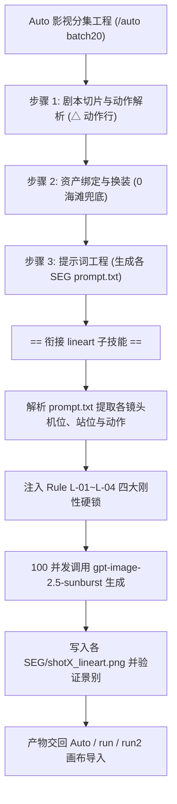

# Lineart — Auto 专属白描分镜线稿生成工程子技能

本 Skill 是 `auto` 影视分集工程的专属子技能（Sub-Skill），专门用于为各集各分段（SEG）生成标准的 **16:9 纯白底黑线 3D 空间站位分镜参考图（Lineart Keyframe Blueprint）**。

---

## 一、 快速命令索引（Commands）

在任何会话中输入 `/lineart` 或配合 Auto 流水线调用：

| 指令 | 目标与范围 | 说明 |
| :--- | :---: | :--- |
| `/lineart batch20` | **第 001 集 ~ 第 020 集** | 全量生成/重绘 Batch 20 的所有分镜站位线稿（100 并发） |
| `/lineart --ep <N>` | **第 N 集** | 精准生成/重绘单集（如 `/lineart --ep 3`）的全部镜头线稿 |
| `/lineart --only-closeups` | **全工程特写纠偏** | 自动排查所有人物镜头，将误写为特写的镜头强制重绘为中景/全景 |
| `/lineart --base-dir <Path>` | **自定义工程目录** | 默认目录为 `C:/Users/JW TSJ/Desktop/完美分镜` |

### 命令行底层直调入口
```powershell
node "C:/Users/JW TSJ/.gemini/config/skills/lineart/scripts/batch-lineart-generator.cjs" --ep 3
```

---

## 二、 核心法定职能与最高红线（Core Invariants & Hard Gates）

### 【核心职能法定界定：定站位骨架，绝非面部写真】
- **白描分镜图（Lineart Reference）的核心法定使命是：**
  1. **定 3D 空间站位（Staging & Coordinates）**；
  2. **定身体朝向与视线方向（Body Orientation & Gaze Direction）**；
  3. **定肢体动作姿态与手势（Pose & Gestures）**；
  4. **定多主体之间、人物与场景/道具的空间几何透视关系（Spatial Geometry）**。
- **白描分镜图绝对不是成片的定妆首帧，更不是为了视频大特写服务的面部肖像写真（Portrait Headshot）**！
- 当输入为大脸特写时，ControlNet 与生成模型将完全丢失全身/半身骨骼姿态、腿部位置、坐卧状态以及与环境道具（如船只、甲板、渔网、桌椅）的空间关系，诱发致命的站位漂移与穿帮。

---

### Rule L-01: 【单镜头 16:9 刚性单画幅熔断多格铁律】
- **正向单画幅锁**：
  `Strictly a SINGLE unified 16:9 widescreen full-frame cinematic camera shot, single camera view, single perspective. Strictly ONE single picture.`
- **负向多格彻底熔断**：
  `Strictly ZERO comic panels, ZERO split screens, ZERO multi-grid layouts, ZERO borders, ZERO comic strips, ZERO multiple frames, ZERO speech bubbles, ZERO thought bubbles, ZERO collage.`

---

### Rule L-02: 【时代排他现代纪实与去古装发髻铁律】
- **现代时代排他硬锁**：
  `Time & Era: Modern contemporary China (2020s), authentic modern coastal realism. All characters: Strictly modern contemporary Chinese people, authentic modern neat short haircuts, modern casual everyday clothes (modern jackets, modern t-shirts, modern workwear, modern village casual wear, sneakers). Strictly ZERO ancient costumes, ZERO historical robes, ZERO topknots, ZERO hair buns, ZERO wuxia/hanfu elements.`
- **剧本同源风格锁**：
  `Visual Style: Authentic Chinese contemporary coastal realism (中国当代沿海现实主义), gritty modern seafaring narrative drama, cinematic lens composition and physical perspective, minimalist 3D line-drawing pre-visualization single frame keyframe sketch, pure black vector line work on pure solid white background, zero shading, zero grayscale, zero fill colors, zero textures, crisp thin black outlines.`

---

### Rule L-03: 【介质透视主客观解耦与大俯角水体透视铁律】
- **彻底杜绝飞鱼上天**：在包含天空或第三人称人物的客观镜头中，严禁描写水底游鱼。
- **大俯角水下主观透视锁**：
  `Camera view: Extreme high-angle top-down bird's eye view looking vertically straight down into transparent seawater (POV looking down at the seabed). Looking down through clear seawater at the seabed terrain: sandy seafloor, submerged rocks, reefs, and seaweed. Schools of marine fish swimming clustered in the seafloor sand. Strictly an underwater environment shot from vertical top-down perspective. Strictly ZERO sky, ZERO horizon, ZERO boats, ZERO human characters, ZERO figures.`

---

### Rule L-04: 【白描分镜强制中景/全景与严禁人脸特写铁律】
- **强制景别归一化（Framing Normalization）**：
  凡是有人物出镜的分镜线稿图，**无论提示词（Prompt）正文中视频动态运镜是否写有“特写”、“大特写”、“近景推至面部”，站位线稿必须且只能生成为【中景（Medium Shot）】或【全景/远景（Full Shot）】**！
- **正向中远景锁**：
  `Shot framing: Medium shot (waist-up mid-shot) or Full shot (wide view) establishing character spatial staging, physical placement, and body orientation in the environment. Full torso, arms, hands, legs, and body orientation clearly visible in relation to the environment and props.`
- **负向特写彻底熔断**：
  `Strictly ZERO extreme close-up, ZERO facial portrait, ZERO headshot, ZERO tight cropping.`

---

### Rule L-05: 【人物头部绝对无五官抽象素体铁律（Faceless Mannequin & Zero Facial Interference Rule）】
- **核心职能隔离**：分镜线稿图仅提供 3D 空间站位、身体朝向与肢体动作蓝图，**绝对严禁包含任何具象五官、写实面容或具体相貌**，严防线稿面部干扰或覆盖角色资产卡的面部骨相！
- **正向无面人/人体模型锁**：
  `All characters are strictly depicted as featureless 3D artist mannequins / faceless pose dummies. Smooth blank oval heads with ZERO facial features (no eyes, no nose, no mouth, no ears, no facial hair). ONLY a subtle 3D crosshair line on the blank egg-shaped head to strictly indicate face direction and head tilt. Body, limbs, and clothing are simplified minimalist geometric outlines establishing spatial staging and body orientation only.`
- **负向五官彻底熔断**：
  `Strictly ZERO facial features, zero human eyes, zero pupils, zero eyebrows, zero nose, zero mouth, zero lips, zero teeth, zero facial expression, zero realistic face, zero detailed portrait, zero facial identity.`

---

### Rule L-06: 【单人/多人出镜人数刚性绝对锁死铁律（Exact Character Count & Anti-Duplication Gate）】
- **单人镜头绝对单人锁（Single Person Hard Lock）**：
  当镜头定义为单人（如 `人物：主体1。` 或仅单个出镜角色）时，**必须显式锁死全画幅严格仅且只有一人（Strictly EXACTLY ONE single solitary person）**；
- **彻底根绝时序动作多主体化（Anti-Temporal Action Duplication）**：
  视频分镜提示词中的【动作/表演】通常包含长达 10~15 秒的时序动作链（如起手拉网 -> 倒鱼入桶 -> 擦汗看天）。**图像扩散模型在绘制单张静态图时极易将不同阶段的时序动作误画为多个人在同时作业（如把 1 个主角画成 2~3 个渔民协同作业）**！
- **正向单人硬锁**：
  `Rule L-06 Exact Character Count Lock: Strictly EXACTLY ONE single solitary person in the entire image. Strictly ZERO other people, ZERO second character, ZERO additional fishermen, ZERO crew members, ZERO onlookers, ZERO duplicate figures representing sequential actions. One solitary person ALONE in the scene.`
- **多角色精准人数锁**：
  当出镜人物为两人（主体1与主体2）时，严格限制画面内仅呈现 2 人，严禁无端幻觉滋生路人、围观者或随从。

---

## 三、 与 Auto 主工程的衔接流水线（Pipeline Integration）



1. **Auto 产出 Prompt**：Auto 完成分集并在 `<集目录>/SEG00X/prompt.txt` 中规划好【镜头1】、【镜头2】及其站位与时间；
2. **Lineart 自动解析并绘图**：Lineart 脚本扫描该集目录，自动提取人物、场景、道具映射及站位要求，规约景别后并发调用生图 API；
3. **物料落地与入边连线**：将生成的 `shot1_lineart.png`、`shot2_lineart.png` 存储于对应 SEG 目录下，作为纯静态站位蓝图，供 `run` (LibTV) 或 `run2` (小云雀) 画布作为入边连线节点。
